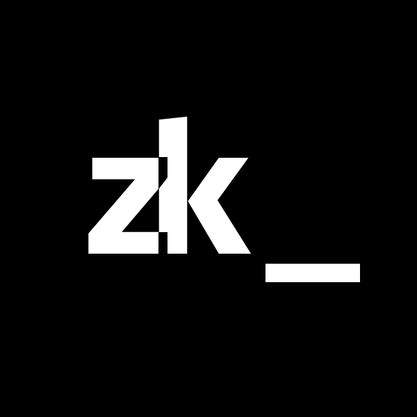

<div align="center">

<h4>A plain text note-taking assistant</h4>

</div>

## Description

`zk` is a command-line tool helping you to maintain a plain text [Zettelkasten](https://zettelkasten.de/introduction/) or [personal wiki](https://en.wikipedia.org/wiki/Personal_wiki).

Looking for a quick usage example? [Let's get started](docs/getting-started.md).

Or want to see it in action? Checkout [Shivan's](https://github.com/shivan-s)
video, [_Note-taking System ALL Programmers Should Consider_](https://www.youtube.com/watch?v=UzhZb7e4l4Y).


### Highlights

* [Creating notes from templates](docs/note-creation.md)
* [Advanced search and filtering capabilities](docs/note-filtering.md) including [tags](docs/tags.md), links and mentions
* [Integration with your favorite editors](docs/editors-integration.md):
    * [Any LSP-compatible editor](docs/editors-integration.md)
    * [`zk-nvim`](https://github.com/zk-org/zk-nvim) for Neovim 0.8+
    * [`zk-vscode`](https://github.com/zk-org/zk-vscode) for Visual Studio Code
    * (*unmaintained*) [`zk.nvim`](https://github.com/megalithic/zk.nvim) for Neovim 0.5+ by [Seth Messer](https://github.com/megalithic)
* [Interactive browser](docs/tool-fzf.md), powered by `fzf`
* [Git-style command aliases](docs/config-alias.md) and [named filters](docs/config-filter.md)
* [Made with automation in mind](docs/automation.md)
* [Notebook housekeeping](docs/notebook-housekeeping.md)
* [Future-proof, thanks to Markdown](docs/future-proof.md)
* Supports most Markdown syntax flavors
    * Links: regular Markdown links, `[[Wikilinks]]` and Neuron's `[[Folgezettel links]]#`.
    * Tags: `#hashtags`, `:colon:separated:tags:`, Bear's `#multi-word tags#`.
    * [YAML frontmatter](docs/note-frontmatter.md)

[See the changelog](CHANGELOG.md) for the list of upcoming features waiting to be released.

### What `zk` is not

* A note editor.
* A tool to serve your notes on the web – for this, you may be interested in [Neuron](docs/neuron.md) or [Gollum](https://github.com/gollum/gollum).

## Install

[Check out the latest release](https://github.com/zk-org/zk/releases) for pre-built binaries for macOS and Linux (`zk` was not tested on Windows).

### Homebrew

```sh
brew install zk
```

Or, if you want to the latest changes:

```sh
brew install --HEAD zk
```

### Nix

```sh
# Run zk from Nix store without installing it:
nix run nixpkgs#zk
# Or, to install it permanently:
nix-env -iA zk
```

### Alpine Linux

`zk` is currently available in the `testing` repositories:

```sh
apk add zk
```

### Arch Linux

You can install [the zk package](https://archlinux.org/packages/extra/x86_64/zk/) from the official repos.

```sh
sudo pacman -S zk
```

### Build from scratch

Make sure you have a working [Go 1.21+ installation](https://golang.org/), then clone the repository:

```sh
$ git clone https://github.com/zk-org/zk.git
$ cd zk
```

#### On macOS / Linux

```
$ make
$ ./zk -h
```

## Contributing

We warmly welcome issues, PRs and [discussions](https://github.com/zk-org/zk/discussions).

Here you can read [some useful info for contributing to `zk`](./CONTRIBUTING.md).

## Related projects

* [Neuron](https://github.com/srid/neuron) – a great tool to publish a Zettelkasten on the web
* [Emanote](https://emanote.srid.ca/) – an improved successor to Neuron
* [sirupsen's zk](https://github.com/sirupsen/zk) – a collection of scripts with a similar purpose
* [zk-spaced](https://github.com/matze/zk-spaced) – spaced repetition plugin for zk
