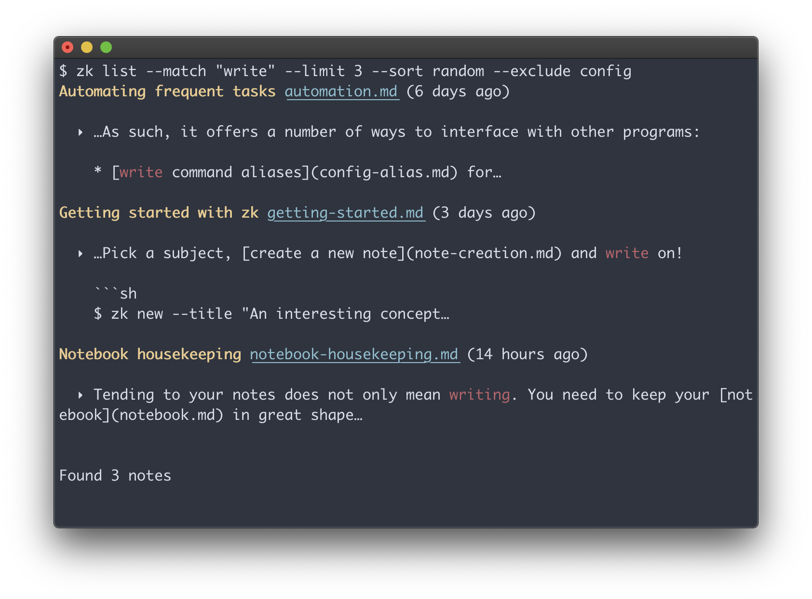

<div align="center">
<h1>zk</h1>
<h4>A plain text note-taking assistant</h4>

</div>

Looking for a quick usage example? [Let's get started](docs/getting-started.md).

## Description

`zk` is a command-line tool helping you to maintain a plain text [Zettelkasten](https://zettelkasten.de/introduction/) or [personal wiki](https://en.wikipedia.org/wiki/Personal_wiki).

It is primarily focused on:

* [keeping your notebook future-proof](docs/future-proof.md), by relying on plain text
* [creating notes from templates](docs/note-creation.md)
* performing [advanced search queries](docs/note-filtering.md)
* being a hub for everything related to your notes, thanks to [command aliases](docs/config-alias.md) and [automation](docs/automation.md).
* [notebook housekeeping](docs/notebook-housekeeping.md)

What `zk` is not:

* a note editor
* a tool to serve your notes on the web – for this, you may be interested in [Neuron](docs/neuron.md) or [Gollum](https://github.com/gollum/gollum).

## Roadmap

* [ ] Tags
* [ ] Link relations
* [ ] Extended YAML front matter support

## Install

`zk` was only tested on macOS and Linux.

### Build from scratch

Make sure you have a working [Go installation](https://golang.org/), with Go's `bin` directory in your `PATH`.

```sh
$ git clone https://github.com/mickael-menu/zk.git
$ cd zk
$ chmod a+x go
$ ./go install
$ zk -h
```

