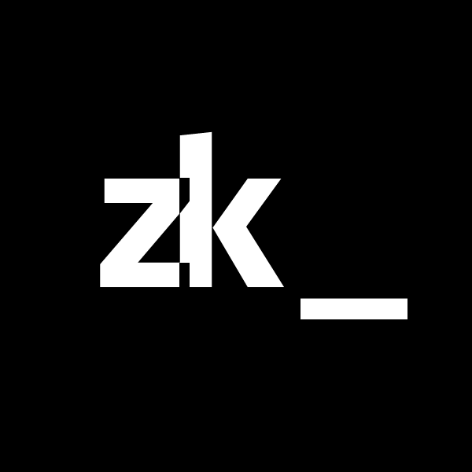

<div align="center">

<h4>A plain text note-taking assistant</h4>

</div>

## Description

`zk` is a command-line tool helping you to maintain a plain text
[Zettelkasten](https://zettelkasten.de/introduction/) or
[personal wiki](https://en.wikipedia.org/wiki/Personal_wiki).

Looking for a [quick usage example?](tips/getting-started)

Or want to see it in action? Checkout [Shivan's](https://github.com/shivan-s)
video,
[_Note-taking System ALL Programmers Should Consider_](https://www.youtube.com/watch?v=UzhZb7e4l4Y).

### Highlights

- [Creating notes from templates](notes/note-creation)
- [Advanced search and filtering capabilities](notes/note-filtering) including
  [tags](notes/tags), links and mentions
- [Integration with your favorite editors](tips/editors-integration):
  - [Any LSP-compatible editor](tips/editors-integration)
  - [`zk-emacs`](https://codeberg.org/mcookly/zk-emacs) for Emacs
  - [`zk-nvim`](https://github.com/zk-org/zk-nvim) for Neovim 0.8+
  - [`zk-vscode`](https://github.com/zk-org/zk-vscode) for Visual Studio Code
- [Interactive browser](config/tool-fzf), powered by `fzf`
- [Git-style command aliases](config/config-alias) and
  [named filters](config/config-filter)
- [Made with automation in mind](tips/automation)
- [Notebook housekeeping](tips/notebook-housekeeping)
- [Future-proof, thanks to Markdown](tips/future-proof)
- Supports most Markdown syntax flavors
  - Links: regular Markdown links and `[[Wikilinks]]`.
  - Tags: `#hashtags`, `:colon:separated:tags:`, Bear's `#multi-word tags#`.
  - [YAML frontmatter](notes/note-frontmatter)

See the changelog in our source code repository for the list of upcoming
features waiting to be released.

### What `zk` is not

- A note editor.
- A tool to serve your notes on the web – for this, there are some
  [static site solutions](tips/static-sites.md).

## Install

[Check out the latest release](https://github.com/zk-org/zk/releases) for
pre-built binaries for macOS and Linux (`zk` was not tested on Windows).

### Homebrew

```sh
brew install zk
```

Or, if you want the latest state of main:

```sh
brew install --HEAD zk
```

### Nix

`zk` is available in nixpkgs and has a
[Home Manager](https://github.com/nix-community/home-manager) module.

If you want to run `zk` without permanently installing it:

```
nix run nixpkgs#zk
```

Or, if you want to create an ephemeral shell with `zk` available:

```
nix shell nixpkgs#zk
```

To permanently install `zk` on NixOS at the system level, include `nixpkgs.zk`
in `environment.systemPackages` in your system configuration
(`/etc/nixos/configuration.nix` by default):

```
environment.systemPackages = [
  # Your other packages here
  nixpkgs.zk
];
```

If you are using [Home Manager](https://github.com/nix-community/home-manager),
instead of installing for all users on the system, you can permanently install
and configure `zk` just for your user via the Home Manager module. Add this to
your Home Manager configuration:

```
programs.zk.enable = true;

# Modify `${XDG_CONFIG_HOME}/zk/config.toml` through this attr
programs.zk.settings = {
  # Add your own configuration settings for zk here
};
```

### Alpine Linux

`zk` is currently available in the `testing` repositories:

```sh
apk add zk
```

### Arch Linux

You can install
[the zk package](https://archlinux.org/packages/extra/x86_64/zk/) from the
official repos.

```sh
sudo pacman -S zk
```

### MacPorts

```sh
sudo port install zk
```

### Build from scratch

Make sure you have a working [Go installation](https://golang.org/) (v1.21+),
then:

```sh
git clone https://github.com/zk-org/zk.git
cd zk
make build
```

The latest state of main can be considered the stable _pre-release_ state. To
use the absolute latest state (bugs to be expected) and to contribute:

```
git checkout dev
make build
```

#### On macOS / Linux

```
$ make
$ ./zk -h
```

## Contributing

We warmly welcome issues, PRs and discussions. Check the `CONTRIBUTING.md` in
our GitHub repository for further information.

## Related projects

- [Neuron](https://github.com/srid/neuron) – a great tool to publish a
  Zettelkasten on the web
- [Emanote](https://emanote.srid.ca/) – an improved successor to Neuron (see
  [Emanote configuration for zk](https://emanote.srid.ca/zk))
- [Weave](https://github.com/matze/weave) – another tool to publish Zettelkasten
  on the web
- [sirupsen's zk](https://github.com/sirupsen/zk) – a collection of scripts with
  a similar purpose
- [zk-spaced](https://github.com/matze/zk-spaced) – spaced repetition plugin for
  zk
- [zk-graph-view](https://github.com/cyberSapoPerro/zk-graph-view) - interactive
  graph visualization plugin for zk
